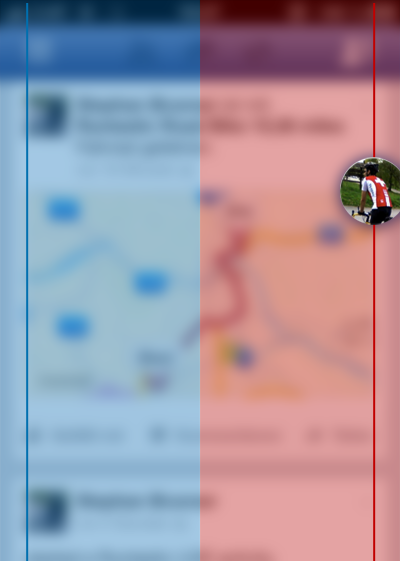
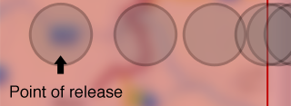
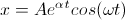
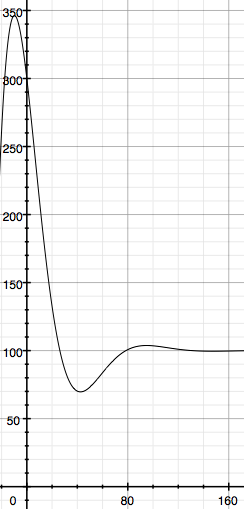

# ChatHeads

ChatHeads is a new feature in [Facebook.app 6.0](http://www.theverge.com/2013/4/16/4230274/facebook-6-0-for-ipad-and-iphone-hands-on-with-chat-heads-stickers) where little bubbles appear in the iOS app when somebody sends you a message. It's a nice little feature and uses very cool animations.

This project is an attempt to re-implement this feature and to figure out how the animations are done. 
I don't support this project in a way to completely implement all features of ChatHeads. It should only illustrate how parts of ChatHeads are done.

## Make it Build

Don't forget to run `git submodule update --init` before building the project. I've added [SKBounceAnimation][SKBounceAnimation-link] and [CAAnimationBlocks](https://github.com/xissburg/CAAnimationBlocks) in the last update.

## The Design

ChatHeads in Facebook.app are little bubbles which show the Friends avatar. They can be dragged around and will snap to the left or right screen edge if they are released. If a ChatHead bubble is pressed, the conversation view appears and the bubbles are arranged at the top of the screen.

The goal of this project was to implement the interaction (drag and release, pressing) with the ChatHead bubbles as well as the animations.

### Interaction Concept

ChatHead bubbles are always snapped to the left or right screen edge. They are partially moved outside of the screen to not cover too much space. The bubbles can be dragged around the screen and will always snap to the screen edge based on where they are released.

All animations have nice bounce effects to make them feel more natural. For example when releasing a ChatHead in the center of the screen, the bubble will snap to the edge and bounce back and forth.

The animation bounce depends on the speed so when a bubble moves very fast it also bounce much more. 

### Animations

I've tried to implement all animations similar to the Facebook.app and make them feel the same. There are a lot of small animations which I had overlooked at first. Here are some explained in more detail.

#### Touching and Dragging

When a bubble is touched, it's scaled down to give a nice feeling of depth. 
When the bubble is released or dragged it gets scaled up again with a nice bounce animation.

[Video](https://dl.dropboxusercontent.com/u/2187517/Uploads/ChatHeads/touch.m4v)

#### Dragging and Releasing

The bubbles can be dragged anywhere on the screen and doesn't block the underlyng UI. After releasing the bubble, it gets moved to the snap position. At the end of the animation, there is a little bounce effect. The intensity of the bounce effect depends on the distance between the release and destination location. 

[Video](https://dl.dropboxusercontent.com/u/2187517/Uploads/ChatHeads/move.m4v)

#### Pressing

If a bubble is pressed (touched but not moved), it gets moved to the top of the screen and a new view appears below it. Facebook presents the conversation history in this view. It's nice that popup view also animates with the same bounce effect as all other animations.

[Video](https://dl.dropboxusercontent.com/u/2187517/Uploads/ChatHeads/states.m4v)

### Implementation

#### Classes
The main two classes are `CHDraggableView` and `CHDraggingCoordinator`. `CHDraggableView` is (as the name already tells) a view which can be dragged around and can contain an arbitrary view. In this project the `CHAvatarView` represents a ChatHead bubble is added as a subview to the `CHDraggableView`. The `CHDraggingCoordinator` is a delegate of the `CHDraggableView` is coordinates where the view should be snapped it. The animation of the bubble is done in the `CHDraggableView`.

#### Animations
<del>The bouncing effect is calculated dynamically based on the distance between the release and destination location.</del>

<del>To get the intensity of the bounce, I calculated the `distance` and `angle` between the start and end point. The `bounceDistance` is 4% of the `distance`.</del>

<del>Based on the angle I calculated `deltaX = sin(angle) * bounceDistance` and `deltaY = cos(angle) * bounceDistance`.</del>

<del>The bubble is first animated to the bounce location and then to the end point.</del>

**Update 2013-04-24**
The bounce animation is now based on a spring mass damper system. Thanks for the tip [Joe Ricioppo](https://twitter.com/joericioppo/status/325325036011520000).

There is an articel from [Soroush Khanlou](http://khanlou.com/2012/01/dampers-and-their-role-in-physical-models/) where he explains the math of a spring mass damper and builds the foundation for another [post](http://khanlou.com/2012/01/cakeyframeanimation-make-it-bounce/) where he implemented a bounce animation in Objective-C called [SKBounceAnimation][SKBounceAnimation-link]. This library calculates values for a bounce animation based on the following equation.

With this equation and correct values from omega (0.06) and alpha (0.04), a simple 1d animation from `x = 300` to `x = 100` could look like this.

That's much better way of doing bounce animations.

#### Avatar Drawing

The drawing of the bubble is done in `CHAvatarView` by using an image and adding a black drop shadow and a white inner shadow.

[SKBounceAnimation-link]: https://github.com/khanlou/SKBounceAnimation
